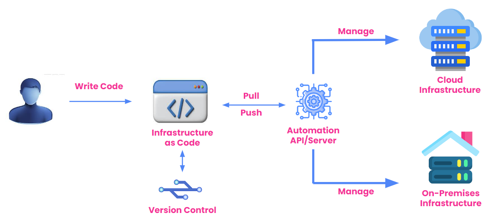

# An Introduction to AWS CloudFormation: Laying the Foundation for Cloud Infrastructure

In today’s cloud-centric world, automating the provisioning of resources is critical for efficiency, scalability, and error reduction. AWS CloudFormation plays a central role in this automation by offering a seamless way to define, manage, and provision infrastructure using templates. Through the power of Infrastructure as Code (IaC), AWS CloudFormation simplifies resource management, making cloud deployments more predictable and consistent.

Let’s explore AWS CloudFormation, its relationship with AWS IaC, and how it can optimize your cloud infrastructure.

---

## I. Understanding AWS CloudFormation

### A. What is AWS IaC?

Infrastructure as Code (IaC) refers to the process of managing and provisioning cloud infrastructure through machine-readable configuration files, rather than relying on manual processes. In the AWS ecosystem, IaC is a key practice for achieving scalable, automated infrastructure management. AWS CloudFormation, AWS CDK, and other services bring this concept to life.

#### How IaC Fits into the AWS Ecosystem
IaC enables AWS users to automate the provisioning of compute, storage, networking, and other AWS services. By treating infrastructure like software, teams can ensure repeatability and consistency across deployments, reducing the manual effort of managing environments.

#### What Problems Can IaC Solve?
IaC addresses several key challenges in cloud infrastructure management:
- **Inconsistencies**: It eliminates human errors that often arise from manual configurations.
- **Scalability**: Infrastructure changes can be rolled out consistently across environments.
- **Speed**: IaC automates resource provisioning, speeding up deployments and updates.

#### Components of IaC
- **Template**: The configuration file that defines the resources and their properties.
- **Execution Engine**: A service or tool (like AWS CloudFormation) that interprets the template and provisions the resources.
- **Resources**: The actual infrastructure being deployed, such as EC2 instances, S3 buckets, or databases.


#### Steps to Carry Out in IaC
1. Write the configuration in a template.
2. Validate the template syntax.
3. Deploy the infrastructure via a service like AWS CloudFormation.
4. Monitor and manage the infrastructure.

#### Manual Approach vs. IaC
The traditional manual approach involves individually configuring each resource through the AWS Management Console or CLI. In contrast, IaC automates this by reading a template and provisioning everything in one go. This makes IaC superior in terms of speed, consistency, and error reduction.

#### Pros and Cons of IaC
- **Pros**: Automated deployments, version control, consistent environments.
- **Cons**: Learning curve, potential for large-scale errors if the template is wrong.

### B. Features of IaC

IaC brings several notable features to cloud management:

- **Reproducibility**: Infrastructure can be replicated across multiple environments with identical results.
- **Idempotency**: Running the same template multiple times won’t create duplicate resources.
- **Composability**: Resources can be modularized and reused across different projects.
- **Evolvability**: IaC enables continuous evolution of infrastructure as the cloud environment grows.


#### Mutable vs. Immutable Infrastructure
- **Mutable Infrastructure**: Allows changes to be made to the existing infrastructure (e.g., updating an EC2 instance directly).
- **Immutable Infrastructure**: Involves replacing infrastructure components instead of modifying them in place, ensuring cleaner updates.

#### Types of IaC Tools
- **Scripting Tools**: Automate resource management via scripts (e.g., AWS CLI).
- **Configuration Management Tools**: Define infrastructure state (e.g., Ansible, Chef).
- **Provisioning Tools**: Focus on automating resource creation (e.g., AWS CloudFormation).
- **Container Orchestration**: Tools like Kubernetes automate container-based deployments.

#### IaC Security
Ensuring that IaC templates are secure is crucial. Misconfigured templates can expose infrastructure to vulnerabilities, such as open ports or improperly secured resources.

#### Vulnerabilities Associated with IaC
Some common security risks include:
- Misconfigured IAM policies
- Publicly exposed sensitive data
- Unrestricted network access

#### IaC Best Practices
- Use version control for IaC templates.
- Follow the principle of least privilege for IAM roles.
- Validate templates using tools like AWS Config and AWS CloudFormation Linter.



### C. What is AWS CloudFormation?

AWS CloudFormation is a service that helps users define and provision cloud infrastructure using templates. It allows you to describe the desired resources in a JSON or YAML template and then manages the deployment and ongoing operations of those resources.


#### Key Features and Benefits in Cloud Infrastructure Management
CloudFormation simplifies infrastructure management by:
- Automating the provisioning of AWS resources.
- Enabling repeatable deployments across different environments.
- Allowing infrastructure to be managed as code.

#### How CloudFormation Fits into the AWS Ecosystem
CloudFormation integrates seamlessly with other AWS services, such as EC2, S3, Lambda, and more. It serves as the foundation for automating and managing infrastructure across AWS accounts, enabling consistency and reducing manual effort.

### D. Why Use AWS CloudFormation?

#### Importance of Infrastructure as Code
By defining infrastructure as code, AWS CloudFormation makes it easy to manage and replicate environments, eliminating the need for manual configurations.

#### Advantages Over Manual Setup and Configuration
Using CloudFormation reduces human error, improves speed, and allows for version-controlled infrastructure. It also supports seamless updates, helping prevent configuration drift between environments.

#### Cost Efficiency and Error Reduction
CloudFormation minimizes errors and the associated costs of downtime or misconfigurations. Additionally, it provides a cost-efficient solution by enabling resource optimization through automation.

### E. Core Components of AWS CloudFormation

- **Stacks**: A stack is a collection of AWS resources that you can manage as a single unit. CloudFormation provisions and manages these resources based on your template.
- **Templates**: Templates act as blueprints for your cloud infrastructure. They define the resources and their configurations.
- **Change Sets**: Change sets allow you to review the impact of updates before applying them, ensuring you don’t unintentionally affect running resources.

---

## II. Setting Up Your First CloudFormation Template

### A. Basic Structure of a CloudFormation Template

#### What is a Stack? Stack LifeCycle?
A stack in CloudFormation represents a collection of AWS resources you manage as a single entity. The stack lifecycle consists of creation, updates, and deletion. During this lifecycle, CloudFormation provisions, manages, and deallocates resources as required.

#### Template Sections
A typical CloudFormation template includes:
- **Metadata**: Optional data about the template itself.
- **Parameters**: Input values passed to the template at runtime.
- **Resources**: AWS services like EC2, S3, RDS, etc.
- **Outputs**: Information about the resources created, such as IP addresses or resource IDs.

#### Essential Syntax and Formatting Guidelines
CloudFormation templates can be written in JSON or YAML. YAML is often preferred due to its readability. Ensure correct indentation and bracket placement for JSON, and use appropriate spacing for YAML.

#### Writing JSON vs. YAML Templates
Both JSON and YAML serve as valid formats for CloudFormation templates. JSON is more strict, while YAML is more human-readable and forgiving in terms of formatting.

### B. Creating a Simple AWS CloudFormation Template

This guide will walk you through creating and deploying a basic AWS CloudFormation template to launch an EC2 instance. We'll be using **VS Code** and **AWS CLI** for this purpose.

## Prerequisites
1. Install [Visual Studio Code](https://code.visualstudio.com/).
2. Install and configure the [AWS CLI](https://docs.aws.amazon.com/cli/latest/userguide/install-cliv2.html).
3. Ensure you have an AWS account with the necessary permissions to create EC2 instances and CloudFormation stacks.

## Steps

### Step 1: Open VS Code
1. Open **VS Code**.
2. Go to **File** > **Open Folder** and create/select a folder where you want to store your CloudFormation files.

### Step 2: Create a YAML File
1. In the Explorer panel, right-click the folder and select **New File**.
2. Name the file `ec2-instance-template.yaml`.

### Step 3: Write the CloudFormation Template
Add the following CloudFormation YAML template into the file and save the file. This template creates an EC2 instance and allows you to specify the instance type through parameters.

```yaml
AWSTemplateFormatVersion: "2010-09-09"
Description: "Create EC2 Instance"

Parameters:
    InstanceParameter:
        Type: String
        Default: t2.micro 
        AllowedValues:
          - t2.micro
          - m1.small
          - m1.large
        Description: "Enter either of the allowed instance types. By default, t2.micro is selected."

Resources:
    Instance:
        Type: AWS::EC2::Instance
        Properties:
            InstanceType: !Ref InstanceParameter
            ImageId: ami-0084a47cc718c111a # Replace with a valid AMI ID for your region

Outputs:
    InstanceName:
        Value: !Ref 'Instance'
```

### 1. **AWSTemplateFormatVersion**
- `AWSTemplateFormatVersion: "2010-09-09"`
-  Specifies the version of the AWS CloudFormation template being used. In this case, "2010-09-09" is the latest version, which is required in every CloudFormation template.

---

### 2. **Description**
- `Description: "Create EC2 Instance"`
-  This is a brief description of what the CloudFormation stack does. In this case, it mentions the purpose: creating an EC2 instance.

---
### 3. **Parameters**
```yaml
    Parameters:
      InstanceParameter:
          Type: String
          Default: t2.micro
          AllowedValues:
            - t2.micro
            - m1.small
            - m1.large
          Description: Enter either of the above allowed instance types. By default t2.micro is selected.
  ```


- This section defines the parameters that the user can customize when launching the CloudFormation stack.
    - **InstanceParameter** is a customizable input, allowing the user to select the EC2 instance type from a predefined set (`t2.micro`, `m1.small`, or `m1.large`).  
    - The `Default` value is set to `t2.micro`.  
    - The `AllowedValues` attribute ensures the input is restricted to valid instance types.  

---

### 4. **Resources**
  ```yaml
    Resources:
      Instance:
          Type: AWS::EC2::Instance
          Properties:
              InstanceType: !Ref InstanceParameter
              ImageId: ami-0084a47cc718c111a
  ```
- This section defines the actual AWS resources that will be created in the CloudFormation stack. [Amazon EC2 Documentation](https://docs.aws.amazon.com/AWSCloudFormation/latest/UserGuide/AWS_EC2.html)
    - **Instance** is the logical ID of the resource. It represents the EC2 instance that will be created.
    - **Type: AWS::EC2::Instance** specifies that an EC2 instance is to be created.
    - **Properties** defines the attributes of the EC2 instance:
        - `InstanceType: !Ref InstanceParameter` references the parameter defined earlier and sets the instance type based on user input.
        - `ImageId: ami-0084a47cc718c111a` specifies the Amazon Machine Image (AMI) ID for the instance. This AMI ID corresponds to a specific region.

---

### 5. **Outputs**
  ```yaml
    Outputs:
      InstanceName:
          Value: !Ref 'Instance'
  ```
- This section provides the output information once the stack is created.
    - **InstanceName**: This output uses the logical ID (`Instance`) of the EC2 instance. The `!Ref` function returns the instance ID of the EC2 resource created, which can be used to reference the instance in other parts of the stack or for post-creation actions.


#### Common Pitfalls and Troubleshooting Tips
- **Validation errors:** Use the AWS CloudFormation Designer to check for template errors.

- **Dependency issues:** Ensure that resources that depend on one another are defined in the correct order.

### C. Deploying CloudFormation Stacks


### Step 1: Validate the CloudFormation Template
Before deploying the template, it's a good practice to validate it.

Open the terminal in VS Code by selecting Terminal > New Terminal.

Run the following command to validate the template:

```bash
aws cloudformation validate-template --template-body file://ec2-instance-template.yaml --region <your region>
```

If successful, the output shows the details of the parameters and description from your CloudFormation template.


### Step 2: Deploy the CloudFormation Stack
Deploy the CloudFormation stack using the AWS CLI:

```bash
 aws cloudformation create-stack --stack-name MyEC2Stack --template-body file://ec2-instance-template.yaml --parameters ParameterKey=InstanceParameter,ParameterValue=t2.micro --region <your-region>
```

Replace MyEC2InstanceStack with the name of your stack.
This command will create an EC2 instance with the instance type t2.micro.


### Step 3: Monitor the Stack Creation
Open the AWS Management Console.
Navigate to CloudFormation.
Find the stack MyEC2InstanceStack and monitor the status. It should move from CREATE_IN_PROGRESS to CREATE_COMPLETE.


### Step 4: Retrieve Outputs
Once the stack creation is complete, you can view the outputs (like the EC2 instance ID):

Click on your stack in the CloudFormation dashboard.
Go to the Resources tab, you can click the Instance id which takes you to AWS EC2 Instance page.
Go to the Outputs tab to retrieve useful information like the instance ID.


### Step 9: Clean Up
To avoid ongoing costs, you can delete the stack after you're done testing:

```bash
aws cloudformation delete-stack --stack-name MyEC2Stack
```
This will terminate the EC2 instance and delete the resources created by the stack.


You have successfully created a simple CloudFormation template to launch an EC2 instance, customized the instance type, and retrieved outputs. You can expand this template by adding more resources and configurations as per your requirements.

## Conclusion
In conclusion, AWS CloudFormation is an essential tool for simplifying cloud infrastructure management through Infrastructure as Code (IaC). It enables developers to automate, scale, and consistently manage resources across AWS environments, making cloud operations more efficient and less error-prone. Whether you're deploying a single EC2 instance or orchestrating a complex multi-tier application, CloudFormation provides a scalable and flexible framework to manage your cloud infrastructure. As you gain proficiency with this tool, you unlock greater opportunities for innovation and optimized cloud management.

## FAQs
**A. What Are the Pricing Considerations for Using AWS CloudFormation?**
AWS CloudFormation itself is free, but you will incur charges for the resources you create, such as EC2 instances, S3 storage, and RDS databases. Additionally, using Change Sets and Stack policies are cost-effective ways to avoid unnecessary expenses by preventing errors and resource misuse.

**B. Can CloudFormation Manage Resources Outside of AWS?**
AWS CloudFormation is primarily designed for managing AWS resources. However, using third-party extensions or integrations, you can manage certain non-AWS resources, but the primary use case remains within the AWS ecosystem.

**C. How Does CloudFormation Handle Failed Deployments?**
In case of failed deployments, AWS CloudFormation will attempt a rollback, undoing any changes made up to the point of failure. You can also define stack policies that control how failures are managed and prevent unintended consequences.

To access the code and examples used in this tutorial, please refer to my GitHub repository: [AWS CloudFormation Tutorial](https://github.com/sharanyagprasad/AWS-CloudFormation-Tutorial)